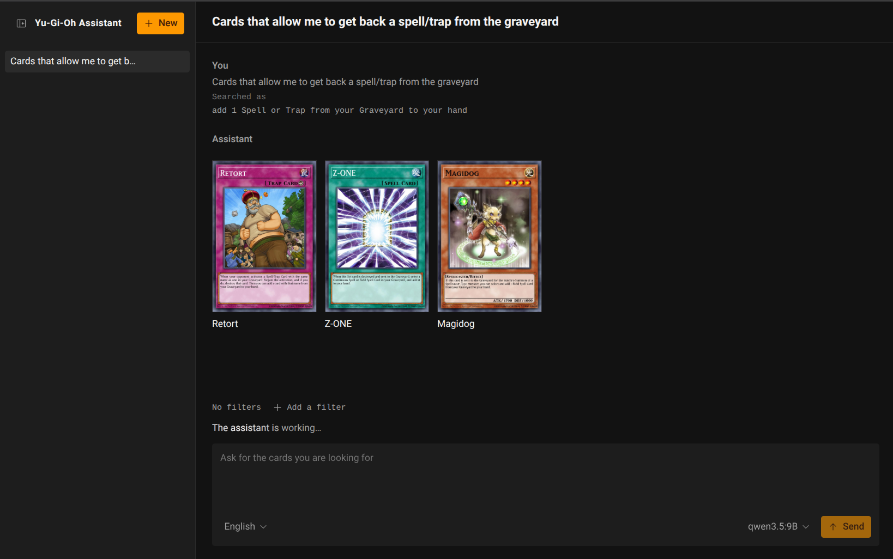
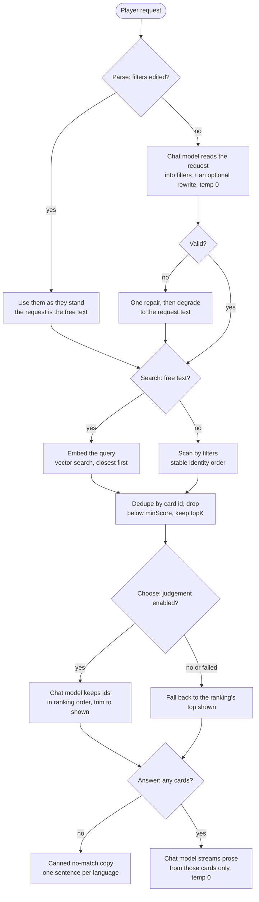

# Yu-Gi-Oh Assistant

A local-only assistant that turns a short natural language request into a
shortlist of Yu-Gi-Oh cards. It answers only from a card catalog indexed on your
machine and only with your local models: nothing leaves the machine, and there
is no account.



## What you need

- **Node.js 26.5.0** and **pnpm 12.4.2**. Both are pinned with mise, so with
  mise installed the right versions are fetched as you enter the repository.
  Otherwise install those exact versions yourself.
- **Ollama**, running and reachable, with an embedding model and at least one
  chat model pulled into it.
- **Network access once**, while you build the card index, to download the card
  dump.

## Set it up

1. Install the workspaces:

   ```sh
   pnpm install
   ```

2. Pull the models. The embedding model is fixed by default:

   ```sh
   ollama pull nomic-embed-text:latest
   ```

   Also pull at least one chat model; the app lets you pick from whatever is
   installed, and a model with structured-output support gives the sharper
   parse. For example:

   ```sh
   ollama pull qwen3.5:9B
   ```

3. Copy the server's environment template:

   ```sh
   cp apps/server/.env.example apps/server/.env
   ```

   Every variable has a default, so the copied file is already valid. Point
   `OLLAMA_BASE_URL` elsewhere if Ollama runs on another host.

4. Build the card index:

   ```sh
   pnpm db:populate
   ```

   This downloads the YGOPRODeck dump for English and French, embeds every card
   with the embedding model, and writes the index under `apps/server/$DATA_DIR`. It
   needs network and Ollama, and takes a few minutes. Re-run it any time to
   refresh the catalog.

## Run it

- **Development:** `pnpm dev` starts the API and the client together. Open
  http://localhost:5173. The Vite dev server proxies API calls to the server on
  http://127.0.0.1:3000, so there is nothing else to configure.
- **Production build:** `pnpm build` builds the client into `apps/web/dist` and
  the server into `apps/server/dist`. `pnpm start` runs the API. The client is a
  static bundle served separately, so set `VITE_API_BASE_URL` before the build
  to the API's public address and `CORS_ORIGIN` on the server to the client's
  origin.

### In containers (optional)

With docker/podman compose, the same stack runs isolated. The pnpm
scripts above stay the primary path.

Before the first run:

- Build the card index on the host (`pnpm db:populate`); the compose file mounts
  it from `apps/server/data`.
- Let Ollama listen beyond loopback, because the server container reaches the
  host through `host.containers.internal`:

  ```sh
  OLLAMA_HOST=0.0.0.0 ollama serve
  ```

- Have `docker/podman-compose` available.

Then:

```sh
docker/podman-compose up --build
```

The client is served on http://localhost:8080 and the API on
http://localhost:3000. Nginx in the client container proxies `/api` and
`/health` to the server, so the browser talks to one origin and no CORS is
needed. The index is mounted from `apps/server/data`, the logs go to a named
volume, and both containers run read-only as a non-root user.

The embedding model and its dimensions must match the index that was populated.
Override them from a root `.env`, which compose reads, for example:

```sh
OLLAMA_EMBEDDING_MODEL=nomic-embed-text:latest
OLLAMA_EMBEDDING_DIMENSIONS=768
```

## How it works

A request runs through four stages. The first two turn the words into a search
and the search into a ranked shortlist; the last two pick the cards worth
showing and write the answer from them alone.



## Configuration

The server reads `apps/server/.env`; `apps/server/.env.example` documents every
variable it understands, with its default and what it does. A few worth knowing:

- `DATA_DIR` (default `./data`, relative to `apps/server`): the card index and
  the SQLite conversation store.
- `OLLAMA_BASE_URL` (default `http://127.0.0.1:11434`): where the models live.
- `HOST` (default `127.0.0.1`): the interface the server binds to. It is
  unauthenticated and holds private conversations, so leave it on loopback
  unless you knowingly put an authenticating proxy in front of it.
- `CORS_ORIGIN` and `ALLOWED_HOSTS` (both unset by default): the extra browser
  origins and hostnames the API accepts. The API refuses a request from any
  other origin or host with `403`, so a web page you visit cannot reach the
  loopback API by rebinding its DNS to `127.0.0.1`.
- `CARD_DUMP_SHA256` and `CARD_DATASET_VERSION` (both unset by default): the
  ingestion pins. Set the first to the SHA-256 of a card dump you verified, and
  populate refuses any other dump. Set the second to the version that
  `pnpm db:populate` reported, and the server refuses an index that holds a
  different one.

The client reads `apps/web/.env`; `apps/web/.env.example` documents its one
variable. Leave `VITE_API_BASE_URL` empty to use the same origin, which the dev
proxy and a reverse proxy both provide.

## Troubleshooting

- The server exits saying no card index was found, or that it is stale: run
  `pnpm db:populate` to build or rebuild it.
- The client says it could not reach the server: check that the API is running,
  and, when the client and server are hosted separately, that `CORS_ORIGIN`
  names the client's origin.

## Where things live

- `apps/server`: the Hono API, the SSE turn stream, the populate command, and
  the composition root.
- `apps/web`: the React client.
- `packages/`: the card domain, the LanceDB index and SQLite store, the
  retrieval pipeline, the Ollama client, the shared contracts, the logger, and
  test support.
- `docs/`: the product intent, the glossary, the architecture, the decision
  records, and the work tracker.
